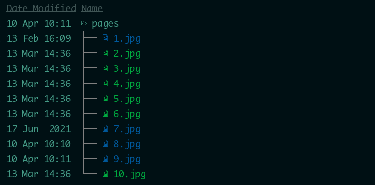
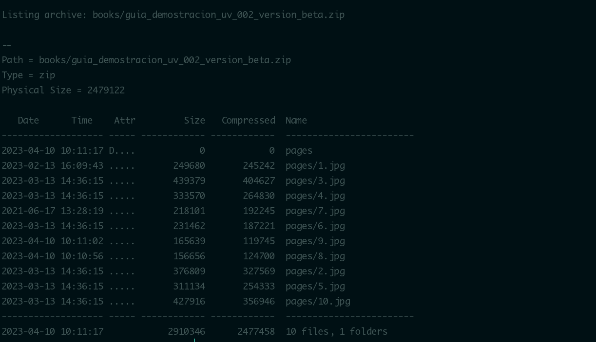
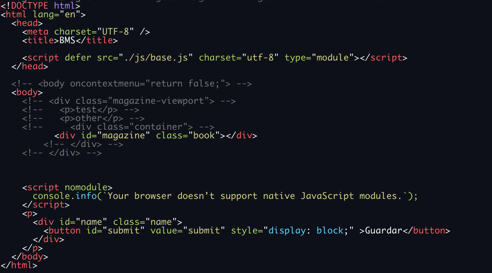
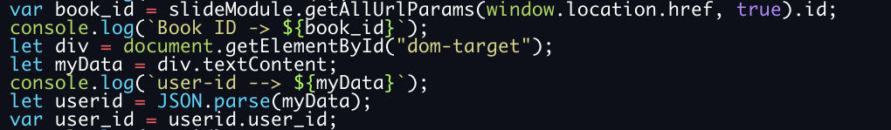

# MKFORMS

Html Forms Maker

# Zip File Structure

zip files are structured as follow:
under directory **pages** put your images in

Inside into zip file

# Install

### Viewer

la instalacion del modulo visor se realiza mediante la configuracion de las librerias lib.js y base.js
y se pueden importar desde un simple archivo por ejemplo viewer.html

Los parametro que puede recibir esta configuracion son user_id y book_id , sus valores se pueden validar mediante la api

viewer.html?book_id=34&user_id=1702

### base.js

EL archivo base.js contiene los parametros de conexion a la api

![15]](./images/viewer_base.png "lib base")

Los parametros a definir son :

- dev : si es verdadero agrega una marca de tiempo al final del documento
- srv_json : el servidor donde esta publicada la api
- port_json : el puerto de acceso
- get_method: el metodo books es el reemplazo de items
- app: [ ediq - extrae los parametros desde la url de la forma <https://server/book_id>,y el user_id lo extrae de la session
  se puede definir un tag no visible con el id ~dom-target~ o cualquier otro metodo
  
  cualquier otro valor toma los parametros del tipo user_id=x&book_id=y

### turn.js

La libreria turn.js que es la encargada de renderizar las paginas de los libros funciona tal cual sin modificaciones
solo parametrizaciones que estan documentadas en su pagina

### lib.js

contiene el funcionamiento del visor
